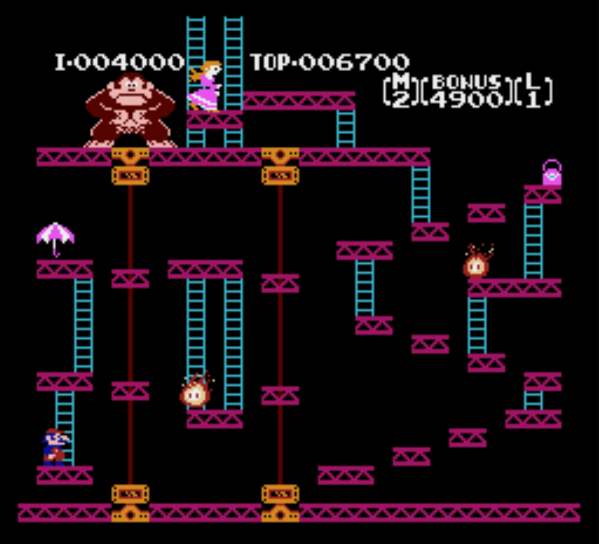

# jNESb

jNESb is a from-scratch Nintendo Entertainment System emulator written in Java. It faithfully re-creates the CPU (6502), PPU (including sprite pipeline and dynamic mirroring), APU (pulse/triangle voices) and I/O bus so commercial ROMs such as **Donkey Kong** or **Adventures of Lolo** can be executed without modification.

## Features
- **CPU/Bus:** Cycle-accurate 6502 core and NES memory map with mapper plug-ins (Mapper 0 & 1 supported).
- **PPU:** Background and sprite rendering, sprite-zero hits, mirroring updates originating from MMC1 writes, OAM DMA ($4014) support and palette management.
- **Audio:** Pulse + triangle channels mixed to a 44.1 kHz PCM stream played via Java Sound.
- **Input:** Standard NES gamepad emulation (keys: `Z`=B, `X`=A, `A`=Select, `S`=Start, arrow keys for D-pad).
- **CLI & UI:** Headless frame runner for automated checks plus a JavaFX desktop window to see and hear the emulator in real time.



## Requirements
- JDK 21 or newer (the project targets release level 25 via the Maven compiler plugin).
- Maven 3.9.11+.

## Building
```
mvn clean package
```
This produces `target/jNESb-0.1.0-SNAPSHOT.jar` containing the emulator classes.

## Running
### Headless / CLI
```
java -cp target/jNESb-0.1.0-SNAPSHOT.jar org.jnesb.App <path-to-rom> [--headless] [--frames=N]
```
- `--headless` keeps rendering disabled and exits after the requested number of frames (defaults to 1).
- `--frames=N` lets you benchmark a ROM or confirm it boots without opening a window.

### JavaFX Front-End
Launch the graphical emulator with audio and keyboard input:
```
mvn -q exec:java -Dexec.mainClass=org.jnesb.App -Dexec.args="<path-to-rom>"
```
Close the window (or press `Ctrl+C` in the terminal) to stop the emulation.

## Testing
Run the automated CPU/PPU/APU/mappers test-suite:
```
mvn test
```
The suite includes unit tests, nestest trace validation, mapper smoke tests and APU frame counter checks.

## Notes
- The emulator expects legal iNES ROM images. Mapper 1 titles (MMC1) rely on the dynamic mirroring callbacks implemented in the cartridge layer.
- Sprite DMA is triggered automatically when a ROM writes to `$4014`; if you see misaligned sprites, ensure the ROM is authentic and not a hacked image.
